# Cinematic Mindscapes: High-quality Video Reconstruction from Brain Activity 
[arXiv](https://arxiv.org/abs/2305.11675) | [Website](https://mind-video.com/).<br/>
<p align="center">

</p>

## MinD-Video
**MinD-Video** is a framework for high-quality video reconstruction from brain recording. <br/>

[**Cinematic Mindscapes: High-quality Video Reconstruction from Brain Activity**](https://arxiv.org/abs/2305.11675).<br/>
[Zijiao Chen](https://scholar.google.com/citations?user=gCTUx9oAAAAJ&hl=en)\*,
[Jiaxin Qing](https://scholar.google.com/citations?user=jpUlRiYAAAAJ&hl=en)\*,
[Juan Helen Zhou](https://scholar.google.com.sg/citations?user=4Z1S3_oAAAAJ&hl=en)<br/>
\* equal contribution <br/>

## News
- Sep. 22, 2023. Accepted by NeurIPS2023 for Oral Presentation. 
- May. 20, 2023. Preprint release.

## Abstract
Reconstructing human vision from brain activities has been an appealing task that helps to understand our cognitive process. Even though recent research has seen great success in reconstructing static images from non-invasive brain recordings, work on recovering continuous visual experiences in the form of videos is limited.
In this work, we propose MinD-Video that learns spatiotemporal information from continuous fMRI data of the cerebral cortex
progressively through masked brain modeling, multimodal contrastive learning with spatiotemporal attention, and co-training with an augmented Stable Diffusion model that incorporates network temporal inflation. 
We show that high-quality videos of arbitrary frame rates can be reconstructed with MinD-Video using adversarial guidance. The recovered videos were evaluated with various semantic and pixel-level metrics. We achieved an average accuracy of 85% in semantic classification tasks and 0.19 in structural similarity index (SSIM), outperforming the previous state-of-the-art by 45%. We also show that our model is biologically plausible and interpretable, reflecting established physiological processes.

## Overview

 


## Samples
- Some samples are shown below. Our methods can reconstruct various objects, animals, motions, and scenes. The reconstructed videos are of high quality and are consistent with the ground truth. For more samples, please refer to our [website](https://mind-video.com/) or download with [google drive](https://drive.google.com/drive/folders/1d7LUkHOMCLUtxvYbgeGAFGIJ4UAmCM0w?usp=sharing).
- The following samples are currently generated with one RTX3090. Due to GPU memory limitation, samples shown below are currently 2 seconds of 3 FPS at the resolution of 256 x 256. But our method can work with longer brain recordings and reconstruct longer videos with full frame rate (30 FPS)  and higher resolution, if more GPU memory is available.
<table>
  <tr>
      <td> &nbsp; &nbsp; &nbsp; &nbsp; GT&nbsp; &nbsp; &nbsp; &nbsp; &nbsp; &nbsp; &nbsp; &nbsp; &nbsp; &nbsp; &nbsp; Ours</td>
      <td> &nbsp; &nbsp; &nbsp; &nbsp; GT&nbsp; &nbsp; &nbsp; &nbsp; &nbsp; &nbsp; &nbsp; &nbsp; &nbsp; &nbsp; &nbsp; Ours</td>
      <td> &nbsp; &nbsp; &nbsp; &nbsp; GT&nbsp; &nbsp; &nbsp; &nbsp; &nbsp; &nbsp; &nbsp; &nbsp; &nbsp; &nbsp; &nbsp; Ours</td>
      <td> &nbsp; &nbsp; &nbsp; &nbsp; GT&nbsp; &nbsp; &nbsp; &nbsp; &nbsp; &nbsp; &nbsp; &nbsp; &nbsp; &nbsp; &nbsp; Ours</td>
      <td> &nbsp; &nbsp; &nbsp; &nbsp; GT&nbsp; &nbsp; &nbsp; &nbsp; &nbsp; &nbsp; &nbsp; &nbsp; &nbsp; &nbsp; &nbsp; Ours</td>
  </tr>
  <tr>
      <td> 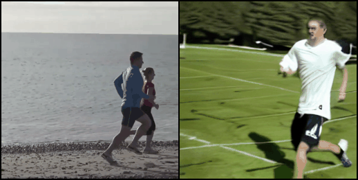</td>
      <td> 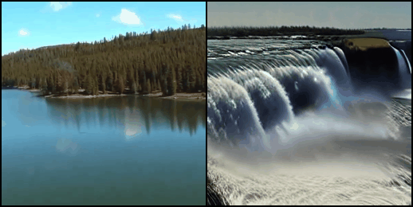</td>
      <td> 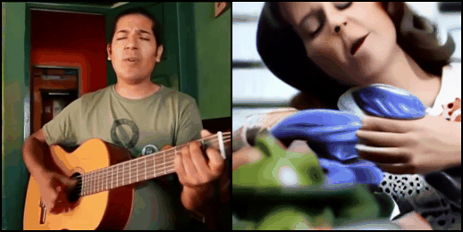</td>
      <td> 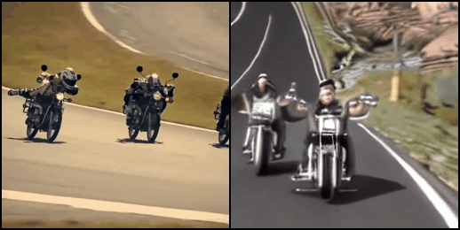</td>
      <td> 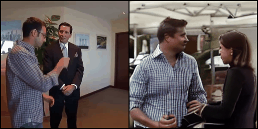</td>
  </tr> 
  <tr>
      <td> 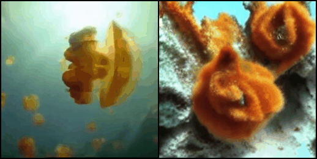</td>
      <td> </td>
      <td> 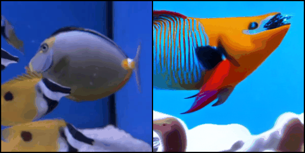</td>
      <td> 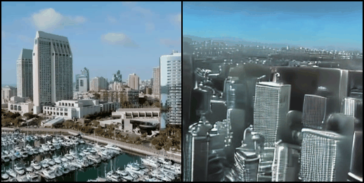</td>
      <td> </td>
    
  </tr>

  <tr>
      <td> 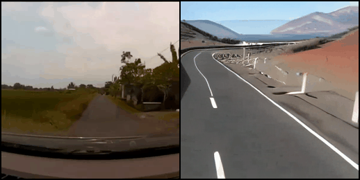</td>
      <td> </td>
      <td> </td>
      <td> 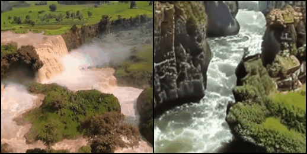</td>
      <td> 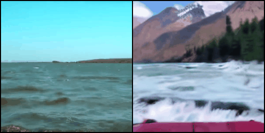</td>
    
  </tr>
</table>

## Environment setup
Create and activate conda environment named ```mind-video``` from our ```env.yaml```
```sh
conda env create -f env.yaml
conda activate mind-video
```

## Download data and checkpoints
The large-scale pre-training dataset is downloaded from [HCP](https://www.humanconnectome.org/). And please refer to this [repo](https://github.com/zjc062/mind-vis) for large-scale pre-training scripts.
Our target dataset Wen (2018) can be downloaded from [here](https://purr.purdue.edu/publications/2809/1). 

Download the pre-trained checkpoints and preprocessed test data from [here](https://drive.google.com/drive/folders/1zqzqy2vqt5cnGbYVkgwx8lYLWjt2H8Z6?usp=sharing). Change the path in the config file accordingly. 

## Replicate our results
### Method 1: Run generation with pretrained checkpoints
```sh
python scripts/eval_all.py --config configs/eval_all_sub1.yaml
```
Set half_precision to True and num_inference_steps to 50 for faster inference.

### Method 2: Download the generated videos and run metrics evaluation
Download the generated videos from [google drive](https://drive.google.com/drive/folders/1d7LUkHOMCLUtxvYbgeGAFGIJ4UAmCM0w?usp=sharing). 
```sh
python scripts/run_metrics.py /path/to/generated/videos
```


## Acknowledgement
We thank the authors of Tune-A-Video for open-sourcing their codes. We also thank the Laboratory of Integrated Brain Imaging at Purdue University for making their data publicly available.

## BibTeX
```
@article{chen2023cinematic,
  title={Cinematic Mindscapes: High-quality Video Reconstruction from Brain Activity},
  author={Chen, Zijiao and Qing, Jiaxin and Zhou, Juan Helen},
  journal={NeurIPS},
  year={2023}
}
```
